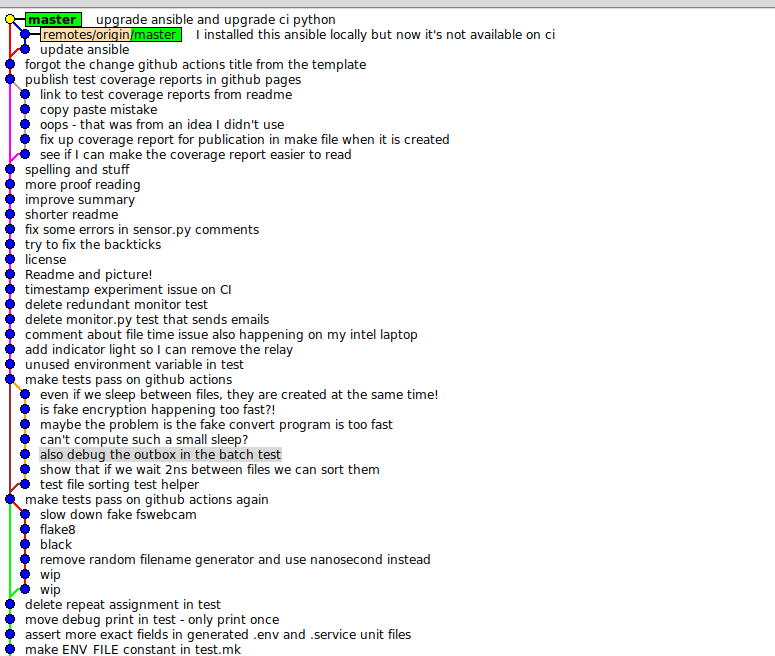

### Ansible

I only use ansible for the stuff I could test by deploying to a local directory.
I know that's not what it's made for, but I find that a lot of ansible scripts
only ever get used once, and every time a change is needed, an update is made
to the script.  Even though the idempotence principle is pretty sound in some
cases, I am skeptical about configuring a new step in an ansible playbook when I
need it (say installing imagemagick), having that step skipped every time I run
the playbooks for now on, because it is already installed, and that step
actually working in a year when I want to insall this on a new device. If you
are constantly deploying to new devices and updating old devices, then the
system can work, or you can make a mistake, and you can get a completely
different result on old devices and new devices.

What I have taken advantage of with ansible is that their different connectors
behave the same in a lot of ways, so some stuff can be tested out against a
local directory on CI, and then I really know that it is maintained, and will
work when I want to program a new device.

The "e2e" tests, that test the application after it has been deployed to a
local directory, and configured with ansible, are not perfect, but they have
proven really useful, and helped me make sure that the subset of the python
dependencies that are deployed to production, for example, are enough to pass
the tests.

Anything that couldn't be tested using that model is done manually once ever,
or if it can't be tested like that, but still needs to be done on every
deployment, like restarting services, is just configured in the deployment task
in the [makefile](../makefile)

In the 'e2e' test, I even add a a library that isn't a requirement, and then
install, and make sure that that library is removed, in order to prove that
the installation will also remove libraries that I remove from the requirements.

Another thing I did different with ansible is that I didn't put the playbooks
in another repo, or in an ansible subdirectory of this repo. I followed more
or less the standard ansible directory structure for the whole project, and put
everything else I am doing into that structure.  The reason is that the purpose
of this project is to configure a raspberry pi for use as a security camera,
and that is what ansible is for.

### Pip

I have done a lot of weird stuff to work around `PIP`. I could have really used
npm's dev and prod dependencies in this case. They are not always useful in
js projects, but sometimes they are. Here, I put together two lists of
dependencies, and have a test (in [test.mk](../test.mk)) to make sure
[one](../setup/requirements.txt) is a subset of [the other](../requirements.txt)

Another thing I had to work around is that pip freeze doesn't work properly
when one of the dependencies comes from github. I had to make my own pip freeze
[wrapper](../tools/pip-freeze.sh) that fixes the output, and then a test to make
sure that the pip freeze wrapper works as expected.

If I were going to continue developing this project, I would look into the next
generation pip tools, and find out if any solve this problem.

### Camera Software

I wanted to add a second camera using USB. I found out that `picamera` doesn't
work for usb cameras, but the command line application `fswebcam` does. At
first I tried to use it for the usb camera while continuing to use `picamera`
for the proper raspberry pi camera. Then I realised I could simplify it by
using `fswebcam` for everything. I could also mock easily by putting a fake
verion into the `PATH`. The fake version just copied an image.

### Email Encryption

https://github.com/juga0/pyac works great for sending a delta.chat compatible
message. In testing I used `npm`'s `openpgp`. However, I found it a lot easier
to read a `delta.chat` message using plain old pgp stuff than to write one.

Some stuff is used directly from the library, and some other stuff I copied
and modified to fit my use case. I would like to copy the whole library, add it
in to test coverage, and find out how much of it I am actually using. Even if I
am only actually using 20 lines of this library, it really helpful for figuring
out how to make this work.

Most of the traditional pgp tools I found are oriented around installing stuff
on your system. These two tools allowed me to just tell it what key files to
use.

I originally tried to use `delta.chat`'s own
[core library](https://github.com/deltachat/deltachat-core-rust/) but it was
but I don't know much about the rust ecosystem, and couldn't figure out how
to scope it so the rest of my application could use it, and then I found this
pure python library. If I am the android replacement for this project that I
mentioned above, I'll probably use delta.chat core.

### Git

If the code in this project is a bit messy sometimes, I tried to make up for
it by keeping the commits super organised:



Every commit on the left hand track (`--first-parent`) passes the tests
and when something is pushed to master that fails the tests, the fixes are
merged into a group. However, there are no three way diffs. If you look at
the history with `--first-parent` (if you are into stuff like git history)
then you will only see incremental changes (is that a good word? atomic?)
that pass the tests. I fix mistakes like this instead of force pushing so
that any commit hash that you see in the CI history is available. Where
there are multiple contributors to a project, you can use this strategy
to combine interdependent commits by different authors so nobody's work
gets squashed into anybody else's.

If you ever want to make a commit group like that, you just do this after
pushing the fix and see that it passes:

```
git reset --hard [commit right _before_ related commits]
git merge --no-ff --log origin/master
```

and then put a headline for the who commit group

### Camera detection

I couldn't find a way to figure out which cameras are attached, so I just made
[this script](../package/discover.sh) that tries to take a picture from every
device path that looks like it might be a camera, and then adds any successful
ones to the list of camera. I don't know how zoom gives you a dropdown of
(more of a "drop up") of camera options.  I wonder if they also just try to take
a picture with each one.
