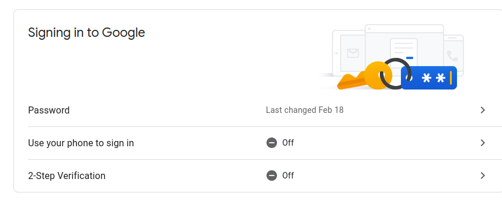
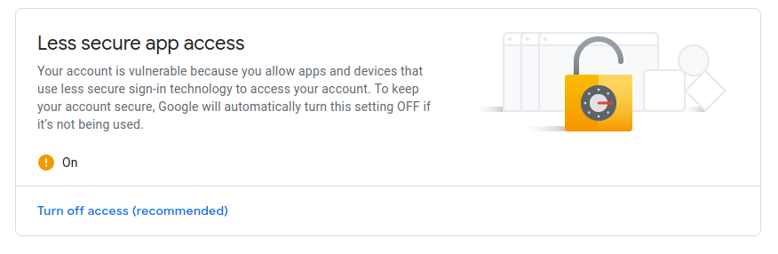
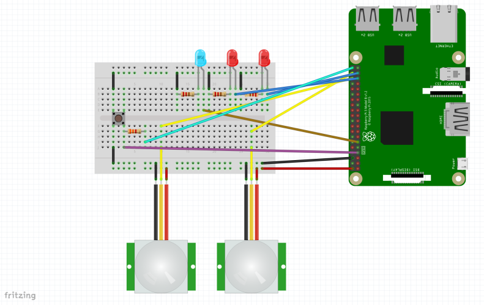
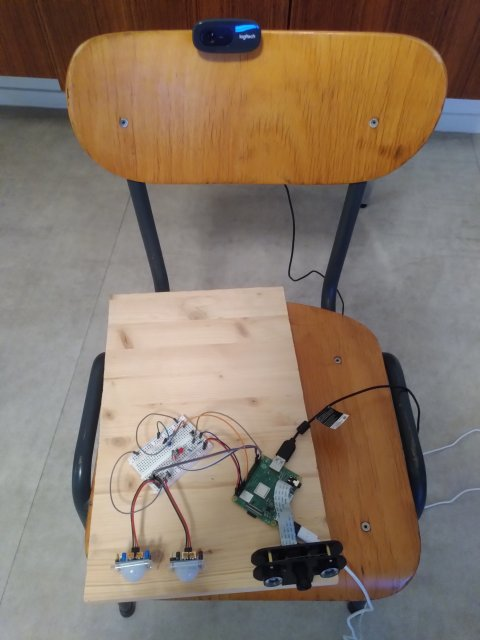

# Build Your Own:

Don't actually build your own. I know very little about most of the subject
matter needed to build this. If you are a beginner, or just looking for a
security camera, you should follow the instructions of an expert.  If you are
somewhere between beginner and expert, you will probably come up with your own
design long before you are done installing mine!

These instructions are just here as a way of documenting my experiment.

## Note about keys:

These instructions tell you to export keys in a few places, but remember to
securely delete them after.

## Preconfigure Raspberry Pi

I only used ansible for the stuff I have to do over and over again, like each
deployment. Since I only have one device, I didn't use it for the stuff I only
have to do once per device.  To configure the device:

- install raspbian
- make it "headless" by disabling hdmi however you like to do that
- connect it to your wifi network, and give it a name

## Install dev environment

I'm sure it's possible to deploy this without all the dev dependencies but I
haven't tried. I have listed all of the system requirements [here](./sysrq.txt)
This file is named after the mysterious key on my keyboard even if it really
stands for [System Request](https://en.wikipedia.org/wiki/System_request)
on the key.

The following will only install dependepencies inside the project directory,
however, it should usually fail if system dependencies are missing.

```
make install
```

## Running the tests

```
make test
```

## Running the "e2e" tests

```
make e2e
```

This will deploy will deploy to the `.target` directory and then run all the
system tests on the instance deployed to that directory, as well as the venv in
that directory. This tries to catch dependencies that are not deployed properly,
and make sure that the pip dependencies that are installed on the target include
everything that is needed (since not all dependencies get deployed), and that
ansible playbooks work correctly.

## Accounts and Client

This project uses [delta.chat](https://delta.chat) as a client
and email as a backend.

You could open the messages with thunderbird or another email client as well
but it works great with delta.chat.

### Set up for one recipient

* Install [delta.chat](https://delta.chat) on your phone
* Configure your personal account
* Create an email account for your camera. (let's call it the "service account")
I used gmail.  However, this project can't do an oauth2 login, and it needs to
stay logged in forever, so I turned off 2-step verification and
allowed less secure login. I think it's OK because all the messages should be
encrypted, and I don't use the account for anything else. This was done in
google account settings, not gmail settings


* Add the service account as a secondary account to delta.chat
* Search around the delta chat configuration until you figure out how to export
keys, and do it for both accounts. You will need both keys for the service
account but you will only need the public key for the personal account, so
delete the private one immediately.
* On the development machine and/or the target machine, create a directory
called 'config' in the project root that looks like this:

```
$ find config
config
config/keys/personal@example.com
config/keys/personal@example.com/public-key-1.asc
config/keys/service@example.com
config/keys/service@example.com/public-key-1.asc
config/keys/service@example.com/private-key-1.asc
config/settings.json
```

and inside `config/settings.json` put something like this:

```
{
  "smtp": {
    "address": "smtp.gmail.com",
    "port": "587",
    "user": "service@example.com",
    "password": "p@$$w0rD"
  },
  "recipients": [
    "personal@example.com"
  ],
  "headers": {
  },
  "sender": "service@example.com"
}

```
If this is on your development machine, and you have installed the dependencies
you should be able to send yourself an encrypted test message like this

```
echo hello | _SECURITY_CAMERA_CONFIG=config venv/bin/python package/send.py package/encryptor.py test
sending batch as test
sending hello topic test
hello sent
```

The subject, which is only visible in your email account, will be 'test' and
the content, which is only visible in delta.chat, will be 'hello'.
(delta.chat doesn't show subjects and your email account probably isn't set
up to show the encrypted message)

You can do the same test on the target machine after installation.

### Multiple Recipients

If you want to send to a `delta.chat` group, this is how I managed to do it
* create the delta.chat group on your phone, with all the members as well as
the camera.
* figure out how to open your delta.chat messages in
[thunderbird](https://www.thunderbird.net/) using openPGP. If you install the
`snap` on in Ubuntu, is has openPGP built in. If you install it with `apt` you
get a much older one. You can make it work by exporting your keys from
delta.chat, and importing them into thunderbird
* open up on of the group messages and look at the headers. you will find one
that looks like `Chat-Group-ID`.. except that is in the encrypted headers
not the unencrypted ones that the message is wrapped in, so you can't figure
it out by viewing message source. You might have to unencrypt the message on
the command line, or export it unencrypted somehow and look at the headers.
* Once you find the chat-group-id somehow (might be available in delta-chat too)
add it to the headers section of the config as below, as well as the other
recipient address
* extract the other group members' public key from thunderbird and save that
to the directory structure described above in a directory analogous to yours.


```
{
  "smtp": {
    "address": "smtp.gmail.com",
    "port": "587",
    "user": "service@example.com",
    "password": "p@$$w0rD"
  },
  "recipients": [
    "personal@example.com",
    "roommate@example.com"
  ],
  "headers": {
    "Chat-Group-ID": "zfYuL5IRQsp"
  },
  "sender": "service@example.com"
}
```

## Assembly



This diagram isn't perfect. Mine is a Raspberry Pi 3A+, but Fritzing only had a
3B.  The breadboard isn't the one I used either.  When I chose the one that
looked like mine, the components that I dragged onto it didn't quite line up
with the holes, and the green dots didn't all appear where they should, so I
chose a similar but different one.

The resistor connected to the button is 1kΩ. The current limiting resistors
connected to the LEDs are whatever value you usually like to use for current
limiting resistos connected to LEDs.

The real wiring looks nothing like this picture.



## New raspberry pi:

- create disk with raspberry pi os lite
- add `boot/ssh` file to make ssh work
- configure wifi like this:
https://howchoo.com/g/ndy1zte2yjn/how-to-set-up-wifi-on-your-raspberry-pi-without-ethernet
(wap_supplicant.conf)
- add security
- add security/config with info from delta.chat
- add security/data empty
- add ssh stuff (make sure any files you create in home are owned by user 1000)
- configure host updated hostname in both /etc/hostname and /etc/hosts


sudo apt-get update
sudo apt-get install fswebcam

then on the computer:
sudo apt-get install python3.7-venv
sudo apt-get install python-venv
sudo apt-get install git

sudo apt-get install imagemagick

```
cd /lib/systemd/system/
sudo ln -s /home/pi/security/security.service 
sudo ln -s /home/pi/security/sensor.service 
```

```
# enable camera like this if you are using a rasberry pi camera
sudo raspi-config
```


after first install
```
sudo systemctl enable security
sudo systemctl enable sensor
```

finally add this cron job

```
0 * * * * set -a && . /home/pi/security/.env && set +a && /home/pi/security/package/cron.sh
```

So you get a heartbeat every hour just to know that everything is OK.

