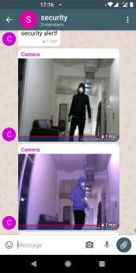
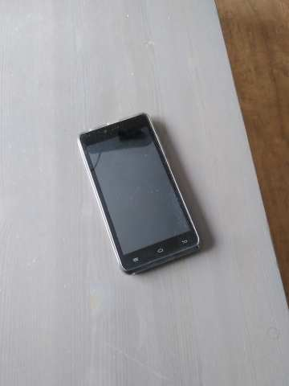

# Serverless Encrypted Security Camera
- uses your email account as the 'backend'
- uses [delta.chat](https://delta.chat) as the client interface
- handles multiple cameras (day and night)
- sends a heartbeat with an image from ever camera every hour (configurable)
- works pretty good
- end to end encrypted (just like delta.chat)

Server side development and web clients are my dayjob, but this project has
neither.

If you don't have delta.chat, get it; it's awesome.

### General Idea

I started by combining two projects from _20 Easy Raspberry Pi Projects_ by
by Rui and Sara Santos (great book)
- Intruder Alarm With Email Notifications
- Burglar Detector with Photo Capture

Then I had to make a few adjustments:
- enrypted messages that work with [delta.chat](https://delta.chat)
using [this library](https://github.com/juga0/pyac)
- two PIR motion sensors that both have to be on to reduce false alarms
- `fswebcam` instead of `picamera` so that I can have multiple cameras using
usb
- automated tests
- new versions deployed with ansible

for the wiring diagram see the [instructions](./docs/preparation.md)

I'm not not an expert on anything in this project. I think a lot about
[automated testing](./tests) though.

This project is a [bunch of little scripts](./package) that call each other.
That's how it started out when I was doing a lot of manual testing, and then I
just left it that way.  I thought about changing it to a single process but then
I found out that multiple processes is actually a plus:
[multiprocessing](https://docs.python.org/3/library/multiprocessing.html)
This way it starts emailing the picture from one camera while it is still
processing the picture from the second camera, and it was fun to test.
I even discovered an awesome ruby package called
[bashcov](https://github.com/infertux/bashcov) to measure test coverage for
bash, which is amazing. Up until now bash is been like a tax haven for test
coverage requirements.

There are two parts of the program running at once as two different
services.  One takes a picture whenever a button is pushed, and one pushes the
button whenever both PIR sensors are activated. They don't really know they
are the same raspberry pi, kind of like _Fight Club_. They talk to one another
through GPIO.  Notes on how it ended up like that are in the comments
[here](package/sensor.py) There are no tests that cover the two programs at the
same time, so at least their interface is really easy to debug.  For manual
testing, it is handy to tune the PIR sensors and try to take pictures
separately. Their connection is a hardware problem... just like the LEDs and
the button.

Take a look at the coverage reports in github actions to see what I mean by
100% test coverage.  Bash and Python, including ansible scripts.

Two situations that are not handled in any test manual or automated are
no internet, and no disk space. It says something about testing, and its
limitations I guess.

### Set-up

Follow [these instructions](./docs/preparation.md), but as expalined, don't
really follow those instructions.. it's just a convenient format for finding
stuff out about this project, or to remember how I did something, or documenting
the stuff that isn't handled by any program.

## Future of the Project

I originally started this project hoping to add two features that were missing
from my nestcam:
* backup power
* backup internet

When I tried to build a simple security camera that I could add those two
features to, it turned out to be not simple at all to get something secure and
reliable. Now I have something secure and reliable and have learned a lot, but
I don't think I am going to add those two features.

I have tried out different raspberry pi backup batteries along the way, and I
can't find one that reliably switches to batter power when unplugged. I also
looked into making a raspberry pi fall back on a different WIFI network
(a mobile one) and then switch back to house wifi when it comes back on, and
that is not that straightfoward either.  Additionally, if the mobile internet
comes from a personal hotspot, the hotspot will usually turn off when there is
nothing connected to it.

Another feature I considered adding was a way to message the camera back by
having the camera check its IMAP or POP3, so you could turn it off remotely
or ask it to take a picture of the current state.

What I finally decided is that even though this has been very educational, and
that this camera is very useful as it is, this might be the wrong design
strategy. There are millions of old android phones lying around. They all have
the ability to switch to mobile internet when wifi is down, or switch to
battery power when there is a blackout. They all have a built in camera, a
screen for configuration, and turning on and off. I just have to solve the
night vision problem. I could also stop worrying about ansible. And hopefully
old hardware wouldn't matter so much if the device only had one task. Here is
the hardware for the next generation of serverless security camera:

### Tests

Most of the tests are in [here](./tests) (the pytest ones). More
straightforward unit tests that are mainly for filling holes in coverage are
sprinkled throughout the project. One the tests in the [tests](./tests)
directory are run in e2e mode. I have put down more thoughts about testing in
the [tests readme](./tests/readme.md), especially what I had to do to make
gpiozero's mock pins work for me.

### Other Interesting Stuff

Other notes are [here](docs/notes.md) about
* unconventional use of ansible
* workarounds for pip
* picamera vs fswebcam
* email encryption
