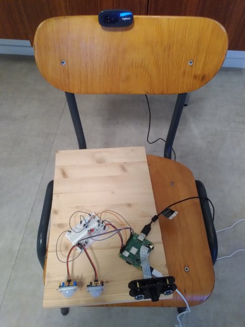

# Serverless Encrypted Security Camera
- uses your email account as the 'backend'
- uses [delta.chat](https://delta.chat) as the client interface
Server side development and web clients are my dayjob so this project has
neither.
- sends a low res image from every camera and then the higher res versions
whenever there is motion because the high res ones send faster than the camera
can be unplugged.
- sends a heartbeat with an image from ever camera every hour (configurable)

## TL;DR

Don't read everything I have written here.. just skim it, and look for headlines
that interest you, or look at the awesome screenshot of an end to end encrypted
security message on my phone.

You probably won't want to read the code either, unless you are looking for
a solution to a specific problem.

If you don't have delta.chat, get it; it's awesome.

### General Idea

I started by combining two projects from _20 Easy Raspberry Pi Projects_ by
by Rui and Sara Santos (great book)
- Intruder Alarm With Email Notifications
- Burglar Detector with Photo Capture

Then I had to make a few adjustments:
- enrypted messages that work with [delta.chat](https://delta.chat)
using [this library](https://github.com/juga0/pyac)
- two PIR motion sensors that both have to be on to reduce false alarms
- `fswebcam` instead of `picamera` so that I can have multiple cameras using
usb
- automated tests
- new versions deployed with ansible

for the wiring diagram see the [instructions](./docs/preparation.md)

I'm not not an expert on anything in this project. I think a lot about
[automated testing](./tests) though.

This project is a [bunch of little scripts](./package) that call each other.
That's how it started out when I was doing a lot of manual testing, and then I
just left it that way.  I thought about changing it to a single process but then
I found out that multiple processes is actually a plus:
[multiprocessing](https://docs.python.org/3/library/multiprocessing.html)
This way it starts emailing the picture from one camera while it is still
processing the picture from the second camera, and it was fun to test.
I even discovered an awesome ruby package called
[bashcov](https://github.com/infertux/bashcov) to measure test coverage for
bash, which is amazing. Up until now bash is been like a tax haven for test
coverage requirements.

There are two parts of the program running at once as two different
services.  One takes a picture whenever a button is pushed, and one pushes the
button whenever both PIR sensors are activated. They don't really know they
are the same raspberry pi, kind of like _Fight Club_. They talk to one another
through GPIO.  There are no tests that cover the two programs at the same time,
so at least their interface is really easy to debug.  For manual testing, it
is handy to tune the PIR sensors and try to take pictures separately. Their
connection is a hardware problem... just like the LEDs and the button.

Take a look at the coverage reports in github actions to see what I mean by
100% test coverage.  Bash and Python, including ansible scripts.

Two situations that are not handled in any test manual or automated are
no internet, and no disk space. It says something about testing, and its
limitations I guess.

### Set-up

Follow [these instructions](./docs/preparation.md), but as expalined, don't
really follow those instructions.. it's just a convenient format for finding
stuff out about this project, or to remember how I did something, or documenting
the stuff that isn't handled by any program.

## Future of the Project

I originally started this project hoping to add two features that were missing
from my nestcam:
* backup power
* backup internet

When I tried to build a simple security camera that I could add those two
features to, it turned out to be not simple at all to get something secure and
reliable. Now I have something secure and reliable and have learned a lot, but
I don't think I am going to add those two features.

I have tried out different raspberry pi backup batteries along the way, and I
can't find one that reliably switches to batter power when unplugged. I also
looked into making a raspberry pi fall back on a different WIFI network
(a mobile one) and then switch back to house wifi when it comes back on, and
that is not that straightfoward either.  Additionally, if the mobile internet
comes from a personal hotspot, the hotspot will usually turn off when there is
nothing connected to it.

Another feature I considered adding was a way to message the camera back by
having the camera check its IMAP or POP3, so you could turn it off remotely
or ask it to take a picture of the current state.

What I finally decided is that even though this has been very educational, and
that this camera is very useful as it is, this might be the wrong design
strategy. There are millions of old android phones lying around. They all have
the ability to switch to mobile internet when wifi is down, or switch to
battery power when there is a blackout. They all have a built in camera, a
screen for configuration, and turning on and off. I just have to solve the
night vision problem. I could also stop worrying about ansible. And hopefully
old hardware wouldn't matter so much if the device only had one task. Here is
the hardware for the next generation of serverless security camera:

## Interesting Stuff

### Ansible

I only use ansible for the stuff I could test by deploying to a local directory.
I know that's not what it's made for, but I find that a lot of ansible scripts
only ever get used once, and every time a change is needed, an update is made
to the script.  Even though the idempotence principle is pretty sound in some
cases, I am skeptical about configuring a new step in an ansible playbook when I
need it (say installing imagemagick), having that step skipped every time I run
the playbooks for now on, because it is already installed, and that step
actually working in a year when I want to insall this on a new device. If you
are constantly deploying to new devices and updating old devices, then the
system can work, or you can make a mistake, and you can get a completely
different result on old devices and new devices.

What I have taken advantage of with ansible is that their different connectors
behave the same in a lot of ways, so some stuff can be tested out against a
local directory on CI, and then I really know that it is maintained, and will
work when I want to program a new device.

The "e2e" tests, that test the application after it has been deployed to a
local directory, and configured with ansible, are not perfect, but they have
proven really useful, and helped me make sure that the subset of the python
dependencies that are deployed to production, for example, are enough to pass
the tests.

Anything that couldn't be tested using that model is done manually once ever,
or if it can't be tested like that, but still needs to be done on every
deployment, like restarting services, is just configured in the deployment task
in the [makefile](./makefile)

In the 'e2e' test, I even add a a library that isn't a requirement, and then
install, and make sure that that library is removed, in order to prove that
the installation will also remove libraries that I remove from the requirements.

Another thing I did different with ansible is that I didn't put the playbooks
in another repo, or in an ansible subdirectory of this repo. I followed more
or less the standard ansible directory structure for the whole project, and put
everything else I am doing into that structure.  The reason is that the purpose
of this project is to configure a raspberry pi for use as a security camera,
and that is what ansible is for.

### Pip

I have done a lot of weird stuff to work around `PIP`. I could have really used
npm's dev and prod dependencies in this case. They are not always useful in
js projects, but sometimes they are. Here, I put together two lists of
dependencies, and have a test (in [test.mk](./test.mk)) to make sure
[one](./setup/requirements.txt) is a subset of [the other](./requirements.txt)

Another thing I had to work around is that pip freeze doesn't work properly
when one of the dependencies comes from github. I had to make my own pip freeze
[wrapper](tools/pip-freeze.sh) that fixes the output, and then a test to make
sure that the pip freeze wrapper works as expected.

If I were going to continue developing this project, I would look into the next
generation pip tools, and find out if any solve this problem.

### Camera Software

I wanted to add a second camera using USB. I found out that `picamera` doesn't
work for usb cameras, but the command line application `fswebcam` does. At
first I tried to use it for the usb camera while continuing to use `picamera`
for the proper raspberry pi camera. Then I realised I could simplify it by
using `fswebcam` for everything. I could also mock easily by putting a fake
verion into the `PATH`. The fake version just copied an image.

### Email Encryption

https://github.com/juga0/pyac works great for sending a delta.chat compatible
message. In testing I used `npm`'s `openpgp`. However, I found it a lot easier
to read a `delta.chat` message using plain old pgp stuff than to write one.

Some stuff is used directly from the library, and some other stuff I copied
and modified to fit my use case. I would like to copy the whole library, add it
in to test coverage, and find out how much of it I am actually using. Even if I
am only actually using 20 lines of this library, it really helpful for figuring
out how to make this work.

Most of the traditional pgp tools I found are oriented around installing stuff
on your system. These two tools allowed me to just tell it what key files to
use.

I originally tried to use `delta.chat`'s own
[core library](https://github.com/deltachat/deltachat-core-rust/) but it was
but I don't know much about the rust ecosystem, and couldn't figure out how
to scope it so the rest of my application could use it, and then I found this
pure python library. If I am the android replacement for this project that I
mentioned above, I'll probably use delta.chat core.

### PIR sensor issues

The story of how I ended up with two services on the same device that talk to
each other over GPIO, as well as other PIR issues, is in a big comment
[here](package/sensor.py)

### Tests

Most of the tests are in [here](./tests) (the pytest ones). More
straightforward unit tests that are mainly for filling holes in coverage are
sprinkled throughout the project. One the tests in the [tests](./tests)
directory are run in e2e mode. I have put down more thoughts about testing in
the [tests readme](./tests/readme.md), especially what I had to do to make
gpiozero's mock pins work for me.
